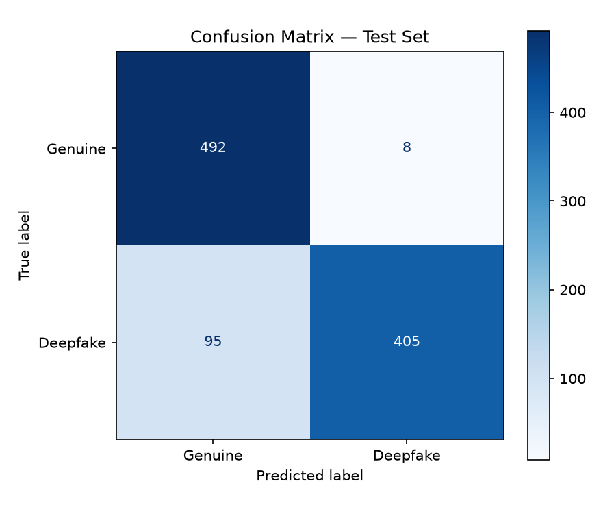

# 🎵 Deepfake Audio Detection Engine

A machine learning system that classifies speech recordings as either
**Genuine (Human)** or **Deepfake (AI-Generated)** using advanced
audio feature extraction and a Neural Network classifier.

---

## 🌐 Live Demo

👉 [Click here to try the Streamlit Web App](https://arjitap-deepfake-audio-detection-app.streamlit.app/)

Upload any `.wav` file and get an instant prediction with confidence score.

---

##  Results on Test Set

| Metric | Score | Target | Status |
|--------|-------|--------|--------|
| Overall Accuracy | 89.70% | ≥ 80% | ✅ PASS |
| F1 Score | 88.72% | ≥ 80% | ✅ PASS |
| Equal Error Rate (EER) | 7.00% | ≤ 12% | ✅ PASS |
| Per-Class Accuracy (Real) | 98.40% | ≥ 75% | ✅ PASS |
| Per-Class Accuracy (Fake) | 81.00% | ≥ 75% | ✅ PASS |

---

## 📁 Project Structure

```
Deepfake_Audio_Detector/
├── data/                          # Audio dataset (not uploaded to GitHub)
│   ├── train/
│   │   ├── real/                  # Genuine training audio
│   │   └── fake/                  # Deepfake training audio
│   ├── val/
│   │   ├── real/
│   │   └── fake/
│   └── test/
│       ├── real/
│       └── fake/
├── models/
│   └── deepfake_audio_model.pkl   # Trained model pipeline
├── notebooks/
│   └── notebook.ipynb             # Full training + evaluation pipeline
├── reports/
│   ├── performance_report.md      # Detailed metrics report
│   └── confusion_matrix_test.png  # Confusion matrix visualization
├── app.py                         # Streamlit web application
├── predict.py                     # Command line prediction script
├── requirements.txt               # Python dependencies
└── README.md                      # This file
```

##  Usage

### Option 1 — Streamlit Web App (Recommended)
👉 [https://arjitap-deepfake-audio-detection-app.streamlit.app/](https://arjitap-deepfake-audio-detection-app.streamlit.app/)

Or run locally:
```bash
streamlit run app.py
```
Open `http://localhost:8501`, upload a `.wav` file and click **Run Analysis**.

### Option 2 — Command Line Script
```bash
python predict.py path/to/your/audio.wav
```

### Option 3 — Jupyter Notebook
Open `notebooks/notebook.ipynb` to see the full pipeline.

For evaluation only (model already trained):
▶ Run Cell 1A — function definitions

▶ Run Cell 3  — load model + evaluate

---

## 🔧 Local Installation

### 1. Clone the repository
```bash
git clone https://github.com/arjitap/Deepfake_Audio_Detector-
cd Deepfake_Audio_Detector-
```

### 2. Create virtual environment
```bash
python -m venv venv

# Windows
venv\Scripts\activate

# Mac/Linux
source venv/bin/activate
```

### 3. Install dependencies
```bash
pip install -r requirements.txt
```

### 4. Download the dataset
- Download from [Kaggle — The Fake or Real Dataset](https://www.kaggle.com/datasets/mohammedabdeldayem/the-fake-or-real-dataset)
- Navigate to the `norm` directory
- Place `train/`, `val/`, `test/` folders inside `data/`

---

## Methodology

### Problem
Generative AI has made it easy to create realistic synthetic speech
(deepfakes). These can be misused for impersonation, fraud, and
misinformation. This project builds a detector that classifies any
speech recording as genuine or AI-generated.

### Dataset
- **Primary:** The Fake-or-Real Dataset (Kaggle)
  - 26,941 real + 26,927 fake training samples
  - 5,400 real + 5,398 fake validation samples
  - 2,264 real + 2,370 fake test samples
- **Format:** `.wav` files, normalized at 16kHz mono

---

##  Pipeline
Raw Audio (.wav)

↓

Load at 16kHz mono (librosa)

↓

Peak Amplitude Normalization

↓

Data Augmentation (fake samples only)

↓

Feature Extraction (225 features)

↓

Class Balancing (upsample real)

↓

StandardScaler

↓

MLP Neural Network

↓

Genuine or Deepfake + Confidence Score

---

##  Feature Extraction (225 features total)

| Feature | Description | Why It Works | Size |
|---------|-------------|--------------|------|
| **MFCC Mean** | Vocal tract shape | AI voices have unnatural MFCC patterns | 40 |
| **MFCC Std** | Variation in vocal tract | Humans have more natural variation | 40 |
| **Delta MFCC** | Rate of change of MFCCs | AI speech transitions too smoothly | 40 |
| **Delta-Delta MFCC** | Acceleration of change | Captures unnatural speech rhythm | 40 |
| **LFCC** | Linear Frequency Cepstral Coefficients | Gold standard for anti-spoofing (ASVspoof) | 40 |
| **Chroma STFT** | Pitch and harmonic content | AI voices have unnatural harmonics | 12 |
| **Spectral Contrast** | Peak vs valley energy | AI voices produce flat robotic frequencies | 7 |
| **ZCR Mean + Std** | Zero crossing rate | AI voices have unnaturally consistent ZCR | 2 |
| **RMS Mean + Std** | Energy variation | Human speech has natural energy bursts | 2 |
| **Spectral Rolloff** | High frequency energy cutoff | Different between human and AI | 1 |
| **Spectral Centroid** | Center of mass of spectrum | Captures tonal quality differences | 1 |
| **Total** | | | **225** |

---

##  Model Architecture
Input Layer (225 features)

↓

Hidden Layer 1 (256 neurons, ReLU)

↓

Hidden Layer 2 (128 neurons, ReLU)

↓

Hidden Layer 3 (64 neurons, ReLU)

↓

Output Layer (2 neurons: Real / Fake)

**Key settings:**

| Parameter | Value | Purpose |
|-----------|-------|---------|
| Optimizer | Adam | Adaptive learning rate |
| Regularization | L2 (alpha=0.05) | Prevents memorizing |
| Early Stopping | Yes (patience=25) | Stops when val stops improving |
| Preprocessing | StandardScaler | Normalizes all 225 features |
| Validation Fraction | 15% | Monitors generalization |

---

## 📊 Data Augmentation Strategy

To help the model generalize to unseen deepfake systems,
fake audio samples were augmented 3x:

| Technique | Details | Purpose |
|-----------|---------|---------|
| Gaussian Noise | σ = 0.003 | Simulates recording conditions |
| Pitch Shift | +1 semitone | Simulates different voice characteristics |
| Time Stretch | rate = 1.1 | Simulates different speaking speeds |

Class balancing was applied after augmentation using upsampling
to ensure equal real and fake samples during training.

---

##  Confusion Matrix



---

##  Requirements
librosa

numpy

scikit-learn

scipy

soundfile

streamlit

joblib

matplotlib

setuptools

---

##  Dataset

**The Fake-or-Real Dataset**
- 📎 [Kaggle Link](https://www.kaggle.com/datasets/mohammedabdeldayem/the-fake-or-real-dataset)
- Used the `norm` directory (pre-normalized audio)
- Train / Val / Test split provided by the dataset

---

##  Author

**Arjita Pathak**
- 🔗 [GitHub](https://github.com/arjitap/Deepfake_Audio_Detector-)
- 🌐 [Live App](https://arjitap-deepfake-audio-detection-app.streamlit.app/)

---